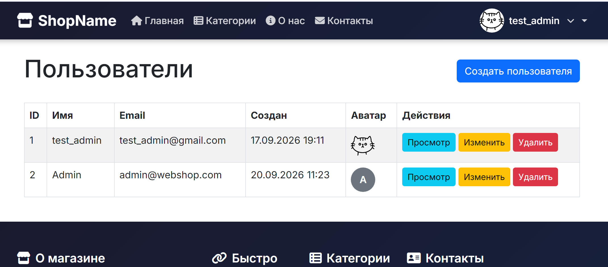
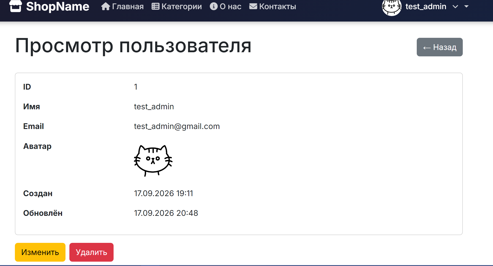
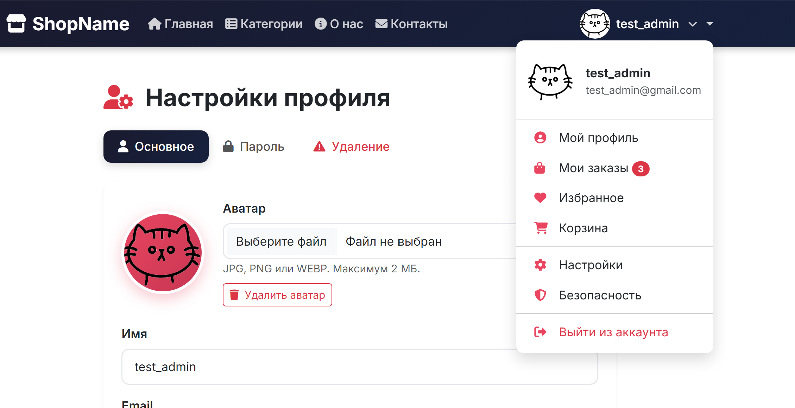

# Администрирование пользователей






# Обновления профиля



# Query Builder и Eloquent — конспект

## Кратко

- Оба инструмента работают поверх PDO.
- **Query Builder** — удобный конструктор SQL-запросов (возвращает `stdClass`).
- **Eloquent** — ORM (Active Record): модели как объекты, связи, события и поведение.

---

## Query Builder

### Назначение

- Формирование SQL без ручного написания строки.
- Подходит для отчётов, агрегатов, массовых операций, когда модель не нужна.

### Основной синтаксис

```php
use Illuminate\Support\Facades\DB;

$rows = DB::table('posts')
    ->select('id', 'title')
    ->where('status', 'published')
    ->orderBy('created_at', 'desc')
    ->limit(10)
    ->get(); // Collection of stdClass
```

### Частые операции

- Выборка: `get()`, `first()`, `pluck()`
- Условия: `where()`, `orWhere()`, `whereIn()`, `whereNull()`
- JOIN: `join()`, `leftJoin()`
- Агрегаты: `count()`, `sum()`, `avg()`, `max()`
- Изменения: `insert()`, `insertGetId()`, `update()`, `delete()`
- Транзакции: `DB::transaction(...)`
- Обработка больших наборов: `chunk()`

#### Пример (join + агрегат)

```php
$totals = DB::table('orders')
    ->join('users', 'orders.user_id', '=', 'users.id')
    ->select('users.id', DB::raw('SUM(orders.total) as total_spent'))
    ->groupBy('users.id')
    ->having('total_spent', '>', 1000)
    ->get();
```

---

## Eloquent (ORM)

### Назначение

- Таблицы представлены как классы-модели.
- Удобен для CRUD, связей, бизнес-логики.

### Пример модели

```php
class Post extends Model
{
    protected $fillable = ['title', 'body', 'user_id'];
    protected $casts = ['published_at' => 'datetime'];
}
```

### CRUD

```php
// Создание
$post = Post::create([...]);

// Поиск
$post = Post::find(1);

// Обновление
$post->update(['title' => 'Новый']);

// Удаление
$post->delete();
```

### Связи и eager loading

- Методы: `hasOne`, `hasMany`, `belongsTo`, `belongsToMany`, `morphMany` и др.
- Eager loading:

    ```php
    $posts = Post::with('user')->get(); // Один запрос вместо N+1
    ```

#### Пример (связь + scope)

```php
$posts = Post::with('user')
    ->published() // custom scope
    ->latest()
    ->get();

foreach ($posts as $post) {
    echo $post->user->name;
}
```

### Scope, аксессоры/мутаторы, события

- **Scope**:

    ```php
    public function scopePublished($q) {
        return $q->where('status', 'published');
    }
    ```

- **Аксессор/мутатор** — через `getFooAttribute`, `setFooAttribute`
- **События**: `creating`, `created`, `updating`, `deleting` и др.
- **Soft Deletes**: trait `SoftDeletes`, поля `deleted_at`, методы `withTrashed()`, `onlyTrashed()`, `restore()`

---

## Ключевые различия

| Критерий         | Query Builder               | Eloquent                  |
|------------------|----------------------------|---------------------------|
| Возвращает       | `stdClass`                 | Экземпляры модели         |
| Связи            | Через JOIN                  | Методы связей (ORM)       |
| Накладные расходы| Меньше                     | Больше (гидратация объектов) |
| Поведение        | Нет                        | Есть (мутаторы, события, traits) |
| Eager loading    | Нет                        | Да (with())               |
| Подходит для     | Агрегаты, отчёты            | CRUD, бизнес-логика, связи |
| Когда использовать | Сложные запросы, массовые операции | Обычные CRUD, связи, объекты |

---

## Когда что использовать

### Query Builder

- Сложные агрегаты, отчёты (`GROUP BY`, `HAVING`)
- Массовые обновления/удаления без загрузки моделей
- Высокопроизводительные операции с минимальным потреблением памяти

### Eloquent

- Обычные CRUD для сущностей (Posts, Users, Orders)
- Когда нужны связи, валидация, события, аксессоры/мутаторы
- Когда удобнее работать с объектами и их поведением

> Часто используют комбинированно: Eloquent для основной логики, Query Builder — для специфичных запросов.

---

## Практические советы

- Всегда профилируйте: Eloquent удобен, но может создавать N+1 запросов — используйте `with()` или `withCount()`.
- Для массовых обновлений/удалений используйте `DB::table(...)->update()` — не загружайте тысячи объектов.
- Используйте `select()` для выбора только нужных полей (в Query Builder и Eloquent).
- В миграциях и тяжёлых запросах оптимизируйте индексы — они важнее микрооптимизаций ORM.

---

# CRUD категорий в Laravel

CRUD — это 4 основные операции над данными:

| CRUD           | Действие  | HTTP            | В нашем проекте             |
| -------------- | --------- | --------------- | --------------------------- |
| **C — Create** | создать   | GET + POST      | создать категорию           |
| **R — Read**   | прочитать | GET             | список / просмотр категории |
| **U — Update** | изменить  | GET + PUT/PATCH | редактировать категорию     |
| **D — Delete** | удалить   | DELETE          | удалить категорию           |

---

# 1. Общая схема

В нашем проекте запрос проходит примерно так:

```text
Браузер
   ↓
routes/web.php
   ↓
CategoryController
   ↓
FormRequest
   ↓
Category Model
   ↓
Database
   ↓
Controller
   ↓
Blade View
   ↓
Браузер
```

Например:

```text
GET /admin/categories
        ↓
CategoryController@index()
        ↓
Category::query()
        ↓
categories table
        ↓
index.blade.php
```

---

# 2. Model — описание категории

Файл:

```text
app/Models/Category.php
```

Модель представляет таблицу `categories`.

Основные поля:

```php
parent_id
slug
title
active
```

Запись в базе:

```text
id:        1
parent_id: null
slug:      electronics
title:     Электроника
active:    true
```

## Связи

### Родительская категория

```php
public function parent(): BelongsTo
{
    return $this->belongsTo(Category::class, 'parent_id', 'id');
}
```

То есть:

```text
Телефоны
   ↓ parent_id
Электроника
```

### Дочерние категории

```php
public function children(): HasMany
{
    return $this->hasMany(Category::class, 'parent_id', 'id');
}
```

Например:

```text
Электроника
├── Телефоны
├── Ноутбуки
└── Телевизоры
```

---

# 3. Routes — какие URL существуют

Файл:

```text
routes/web.php
```

Мы используем:

```php
Route::prefix('admin')
    ->name('admin.')
    ->group(function () {
        Route::resource('categories', CategoryController::class);
    });
```

`Route::resource()` автоматически создаёт 7 маршрутов:

```text
GET       /admin/categories
POST      /admin/categories
GET       /admin/categories/create
GET       /admin/categories/{category}
PUT/PATCH /admin/categories/{category}
DELETE    /admin/categories/{category}
GET       /admin/categories/{category}/edit
```

Они связываются с методами контроллера:

```text
index   → список
create  → форма создания
store   → сохранение
show    → просмотр
edit    → форма редактирования
update  → обновление
destroy → удаление
```

---

# 4. READ — список категорий

URL:

```text
GET /admin/categories
```

Вызывается:

```php
public function index(): View
{
    $categories = Category::query()
        ->with('parent')
        ->orderBy('title')
        ->paginate(20);

    return view(
        'admin.categories.index',
        compact('categories')
    );
}
```

Что происходит:

```text
GET /admin/categories
        ↓
index()
        ↓
Category::query()
        ↓
SELECT ... FROM categories
        ↓
$categories
        ↓
admin/categories/index.blade.php
```

В Blade:

```blade
@foreach($categories as $category)
    {{ $category->title }}
@endforeach
```

---

# 5. CREATE — открыть форму

URL:

```text
GET /admin/categories/create
```

Вызывается:

```php
public function create(): View
{
    $categories = Category::query()
        ->orderBy('title')
        ->get();

    return view(
        'admin.categories.create',
        compact('categories')
    );
}
```

Здесь база ещё **не изменяется**.

Мы просто получаем список категорий, чтобы показать его в `<select>`:

```text
Родительская категория:
[ Электроника       ▼ ]
```

---

# 6. CREATE — отправить форму

Форма делает:

```text
POST /admin/categories
```

Например:

```text
title = Телефоны
slug = phones
parent_id = 1
active = 1
```

Запрос попадает в:

```php
store(StoreCategoryRequest $request)
```

Сначала работает `StoreCategoryRequest`.

Он проверяет:

```php
'title' => ['required', 'string', 'max:255'],
'slug' => ['required', 'string', 'max:100', 'unique:categories,slug'],
'parent_id' => ['nullable', 'exists:categories,id'],
```

Если данные неправильные:

```text
Form
 ↓
Validation
 ↓
ошибка
 ↓
обратно на форму
```

Если правильные:

```text
Form
 ↓
Validation OK
 ↓
Controller
```

Контроллер:

```php
Category::create($request->validated());
```

Здесь происходит INSERT:

```text
INSERT INTO categories (...)
```

После этого:

```php
return redirect()
    ->route('admin.categories.index')
    ->with('success', 'Категория успешно создана.');
```

Пользователь возвращается к списку.

---

# 7. FormRequest — зачем он нужен

У нас два класса:

```text
app/Http/Requests/Admin/StoreCategoryRequest.php
app/Http/Requests/Admin/UpdateCategoryRequest.php
```

Их задача:

```text
проверить входные данные
```

Например:

```php
'slug' => [
    'required',
    'string',
    'max:100',
    'unique:categories,slug',
],
```

То есть Controller не должен заниматься всей проверкой самостоятельно.

Получается:

```text
Request
   ↓
FormRequest
   ↓
validated()
   ↓
Controller
```

Контроллер получает уже проверенные данные:

```php
$request->validated()
```

---

# 8. UPDATE — открыть форму редактирования

URL:

```text
GET /admin/categories/1/edit
```

Laravel видит:

```text
{category}
```

и благодаря **Route Model Binding** автоматически получает:

```php
Category $category
```

То есть вместо:

```php
$id = 1;

$category = Category::findOrFail($id);
```

Laravel сам делает это за нас.

Метод:

```php
public function edit(Category $category): View
```

Дальше передаём категорию в Blade:

```php
return view(
    'admin.categories.edit',
    compact('category', 'categories')
);
```

---

# 9. UPDATE — сохранить изменения

Форма отправляет:

```text
PUT /admin/categories/1
```

или:

```text
PATCH /admin/categories/1
```

Laravel вызывает:

```php
update(
    UpdateCategoryRequest $request,
    Category $category
)
```

Проверяется `UpdateCategoryRequest`.

Затем:

```php
$category->update($request->validated());
```

В базе происходит примерно:

```sql
UPDATE categories
SET
    title = ...,
    slug = ...,
    parent_id = ...,
    active = ...
WHERE id = 1;
```

После этого:

```php
return redirect()
    ->route('admin.categories.index')
    ->with('success', 'Категория успешно обновлена.');
```

---

# 10. DELETE — удалить категорию

Форма отправляет:

```text
DELETE /admin/categories/1
```

Laravel вызывает:

```php
destroy(Category $category)
```

И:

```php
$category->delete();
```

Происходит:

```sql
DELETE FROM categories
WHERE id = 1;
```

После удаления:

```php
return redirect()
    ->route('admin.categories.index');
```

---

# 11. SHOW — просмотр одной категории

URL:

```text
GET /admin/categories/1
```

Метод:

```php
public function show(Category $category): View
{
    $category->load([
        'parent',
        'children',
        'products',
    ]);

    return view(
        'admin.categories.show',
        compact('category')
    );
}
```

Здесь можно получить:

```php
$category->parent
$category->children
$category->products
```

Например:

```text
Электроника

Дочерние категории:
- Телефоны
- Ноутбуки
- Телевизоры
```

---

# 12. Blade — отображение HTML

Наши представления:

```text
resources/views/admin/categories/

index.blade.php
create.blade.php
edit.blade.php
show.blade.php
```

Они отвечают только за интерфейс.

Например:

```blade
{{ $category->title }}
```

выводит название.

А:

```blade
<form method="POST" action="...">
```

отправляет данные обратно в Laravel.

---

# 13. Layout

Все страницы категорий используют:

```blade
@extends('layouts.main')
```

То есть:

```text
layouts/main.blade.php
        ↓
@extends
        ↓
@yield('content')
        ↑
index/create/edit/show
```

В category Blade:

```blade
@section('content')

    ...

@endsection
```

Этот HTML вставляется сюда:

```blade
<main class="main-content">
    <div class="container py-4">
        @yield('content')
    </div>
</main>
```

---

# 14. $parentCategories

`main.blade.php` использует:

```blade
@foreach($parentCategories as $parentCategory)
```

Поэтому мы добавили View Composer в:

```text
app/Providers/AppServiceProvider.php
```

Он делает:

```php
View::composer('layouts.main', function ($view) {
    ...
});
```

Получается:

```text
Любая страница
      ↓
layouts.main
      ↓
AppServiceProvider
      ↓
получаем parentCategories
      ↓
layouts.main
```

Это удобно, потому что не нужно писать в каждом контроллере:

```php
$parentCategories = ...
```

---

# 15. Полная схема CRUD

## CREATE

```text
GET /admin/categories/create
        ↓
create()
        ↓
create.blade.php
        ↓
POST /admin/categories
        ↓
StoreCategoryRequest
        ↓
store()
        ↓
Category::create()
        ↓
Database INSERT
```

## READ

```text
GET /admin/categories
        ↓
index()
        ↓
Category::query()
        ↓
Database SELECT
        ↓
index.blade.php
```

## UPDATE

```text
GET /admin/categories/1/edit
        ↓
edit()
        ↓
edit.blade.php
        ↓
PUT /admin/categories/1
        ↓
UpdateCategoryRequest
        ↓
update()
        ↓
$category->update()
        ↓
Database UPDATE
```

## DELETE

```text
DELETE /admin/categories/1
        ↓
destroy()
        ↓
$category->delete()
        ↓
Database DELETE
```

---


# Конспект: Структура проекта Laravel (Blade)


## 1. ОБЩАЯ СТРУКТУРА

laravel-project/

├── app/           // Ядро приложения (код)

├── bootstrap/     // Автозагрузка и стартовая загрузка

├── config/        // Все конфигурационные файлы

├── database/      // Миграции, сиды, фабрики

├── public/        // Корневая папка для веб-сервера

├── resources/     // Blade-шаблоны, ассеты, языковые файлы

├── routes/        // Определение всех маршрутов

├── storage/       // Логи, кэш, загруженные файлы

├── tests/         // Автотесты

├── vendor/        // Зависимости Composer

├── .env           // Настройки окружения

├── artisan        // CLI-инструмент

└── composer.json  // PHP-зависимости


## 2. КЛЮЧЕВЫЕ ДИРЕКТОРИИ

app/ — код приложения

├── Http/

│   ├── Controllers/   // Обработка запросов

│   ├── Middleware/    // Фильтры HTTP-запросов

│   └── Requests/      // Валидация форм

├── Models/            // Eloquent-модели для БД

└── Providers/         // Регистрация сервисов


Controller обычно:
получает запрос;
вызывает нужную бизнес-логику;
получает данные;
передаёт данные в представление;
возвращает ответ.

resources/ — представления

├── views/             // Blade-шаблоны (.blade.php)

│   ├── layouts/       // Базовые макеты страниц

│   ├── components/    // Переиспользуемые x-компоненты

│   ├── partials/      // Частичные фрагменты

│   └── pages/         // Цельные страницы

├── css/               // Стили (через Vite)

├── js/                // Скрипты (через Vite)

└── lang/              // Языковые строки

Здесь находятся ресурсы, которые используются для создания интерфейса.


routes/ — маршрутизация

├── web.php            // Веб-маршруты (CSRF, сессии)

└── console.php        // Artisan-команды

config/ — настройки

├── app.php            // Основные параметры

├── database.php       // Подключения БД

├── auth.php           // Аутентификация

├── cache.php          // Кэширование

├── mail.php           // SMTP-настройки

├── queue.php          // Очереди

└── filesystems.php    // Диски хранения

database/ — БД

├── migrations/        // Структура таблиц

├── seeders/           // Начальные данные

└── factories/         // Тестовые данные


## Вся цепочка Laravel + Blade

                 Laravel
                    │
                    ▼
             routes/web.php
                    │
                    ▼
               Middleware
                    │
                    ▼
                Controller
                    │
                    ▼
                  Model
                    │
                    ▼
                Database
                    │
                    ▼
                  Model
                    │
                    ▼
               Controller
                    │
                    ▼
              Blade View
                    │
                    ▼
                  HTML
                    │
                    ▼
                Browser       


## MVC = Model + View + Controller

                 БРАУЗЕР
                    │
                    │ GET /users
                    ▼
             routes/web.php
                    │
                    ▼
          UserController@index
                    │
                    │
             ┌──────┴──────┐
             │             │
             ▼             │
          User Model       │
             │             │
             ▼             │
          Database         │
             │             │
             │ users       │
             │             │
             └──────┬──────┘
                    │
                    │ данные
                    ▼
             UserController
                    │
                    ▼
          users/index.blade.php
                    │
                    ▼
                  HTML
                    │
                    ▼
                 БРАУЗЕР     

Laravel:
получает HTTP-запрос;
смотрит маршрут в routes/web.php;
запускает middleware;
вызывает Controller;
Controller может обратиться к Model;
Model получает данные из БД;
Controller передаёт данные в Blade;
Blade генерирует HTML;
Laravel отправляет HTML браузеру.

## Передача данных с бекенда на фронтенд в шаблонизатор Blade (в представление products.index).

### routes/web.php

```php
Route::get('/products', function () {
    $products = Product::all();

    return view('products.index', compact('products'));
});
```

### resources/views/products/index.blade.php
```php
<h1>Products</h1>

@foreach ($products as $product)
    <h2>{{ $product->name }}</h2>
    <p>{{ $product->description }}</p>
    <p>Цена: {{ $product->price }}</p>
    <p>Остаток: {{ $product->stock }}</p>
@endforeach
```

<p align="center"><a href="https://laravel.com" target="_blank"></a></p>

<p align="center">
<a href="https://github.com/laravel/framework/actions"></a>
<a href="https://packagist.org/packages/laravel/framework"></a>
<a href="https://packagist.org/packages/laravel/framework"></a>
<a href="https://packagist.org/packages/laravel/framework"></a>
</p>

## About Laravel

Laravel is a web application framework with expressive, elegant syntax. We believe development must be an enjoyable and creative experience to be truly fulfilling. Laravel takes the pain out of development by easing common tasks used in many web projects, such as:

- [Simple, fast routing engine](https://laravel.com/docs/routing).
- [Powerful dependency injection container](https://laravel.com/docs/container).
- Multiple back-ends for [session](https://laravel.com/docs/session) and [cache](https://laravel.com/docs/cache) storage.
- Expressive, intuitive [database ORM](https://laravel.com/docs/eloquent).
- Database agnostic [schema migrations](https://laravel.com/docs/migrations).
- [Robust background job processing](https://laravel.com/docs/queues).
- [Real-time event broadcasting](https://laravel.com/docs/broadcasting).

Laravel is accessible, powerful, and provides tools required for large, robust applications.

## Learning Laravel

Laravel has the most extensive and thorough [documentation](https://laravel.com/docs) and video tutorial library of all modern web application frameworks, making it a breeze to get started with the framework.

In addition, [Laracasts](https://laracasts.com) contains thousands of video tutorials on a range of topics including Laravel, modern PHP, unit testing, and JavaScript. Boost your skills by digging into our comprehensive video library.

You can also watch bite-sized lessons with real-world projects on [Laravel Learn](https://laravel.com/learn), where you will be guided through building a Laravel application from scratch while learning PHP fundamentals.

## Agentic Development

Laravel's predictable structure and conventions make it ideal for AI coding agents like Claude Code, Cursor, and GitHub Copilot. Install [Laravel Boost](https://laravel.com/docs/ai) to supercharge your AI workflow:

```bash
composer require laravel/boost --dev

php artisan boost:install
```

Boost provides your agent 15+ tools and skills that help agents build Laravel applications while following best practices.

## Contributing

Thank you for considering contributing to the Laravel framework! The contribution guide can be found in the [Laravel documentation](https://laravel.com/docs/contributions).

## Code of Conduct

In order to ensure that the Laravel community is welcoming to all, please review and abide by the [Code of Conduct](https://laravel.com/docs/contributions#code-of-conduct).

## Security Vulnerabilities

If you discover a security vulnerability within Laravel, please send an e-mail to Taylor Otwell via [taylor@laravel.com](mailto:taylor@laravel.com). All security vulnerabilities will be promptly addressed.

## License

The Laravel framework is open-sourced software licensed under the [MIT license](https://opensource.org/licenses/MIT).
